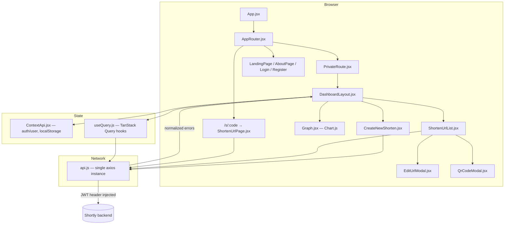

<div align="center">

# 🔗 Shortly

### A full-featured URL shortener frontend — custom aliases, password-protected links, tags & favorites, bulk operations, deep analytics, and QR codes.

[](https://react.dev/)
[](https://vite.dev/)
[](https://tailwindcss.com/)
[](https://tanstack.com/query)
[](https://reactrouter.com/)
[](../LICENSE)

**[Features](#-features) · [Architecture](#%EF%B8%8F-architecture) · [Tech Stack](#%EF%B8%8F-tech-stack) · [Getting Started](#-getting-started) · [Project Structure](#-project-structure) · [Routes](#-routes) · [Deployment](#-deployment) · [FAQ](#-faq)**

</div>

---

## ✨ Overview

**Shortly** turns long, ugly URLs into short, trackable, shareable links — with the kind of feature set you'd expect from a paid product, not a side project.

This repository is the **React SPA frontend**, built to sit in front of the [`shortly-springboot`](../) backend. It's decoupled from the backend by a single environment variable (`VITE_BACKEND_URL`), so you can point it at a local instance, a staging server, or production without touching a line of code.

Every feature the backend exposes has a home here: creating and editing links, password protection, tags/favorites with search, bulk create/delete, per-link analytics with browser/OS/device/referrer breakdowns, QR codes, and CSV export — on top of JWT auth with email verification and self-service account deletion with a recovery grace period.

> 💡 **Why this project stands out:** most "URL shortener" tutorials stop at *create a short link*. Shortly ships bulk creation, password-protected redirects, one-time links, subdomain-aware routing, and a real analytics dashboard — the parts that actually make a shortener production-grade.

---

## 🚀 Features

### 🔗 Links
| Feature | Where |
|---|---|
| 🔗 **Create short URLs**, single or **bulk** (up to 50 at once) | Dashboard → Create New Link |
| 🏷️ **Custom aliases** | Create form → Advanced Options |
| ✏️ **Edit links** — destination, active state, favorite, tags, password | Edit button on any link |
| 🔒 **Password-protected links** — set at creation or later; visitors unlock with a password prompt before the redirect resolves | Create/Edit forms, `/s/:code` unlock screen |
| ⭐ **Favorites** — one-click star toggle | Link list |
| 🏷️ **Tags** + **search/filter** by text, tag, or favorites-only | Dashboard search bar |
| 📦 **Bulk select + delete** | Dashboard "Select" mode |
| ⏰ **Expiring links** and **🔐 one-time links** | Create form → Advanced Options |
| 📱 **QR codes**, downloadable PNG | QR button on any link |
| ⬇️ **CSV export** of all your links | Dashboard → Export CSV |

### 📊 Analytics
| Feature | Where |
|---|---|
| 📊 Daily click totals across all links | Dashboard chart |
| 📈 Per-link daily click chart | Link → Analytics |
| 🌐 Browser / OS / device type / referrer breakdown | Link → Analytics (below the chart) |

### 👤 Account
| Feature | Where |
|---|---|
| 👤 Register / login with **email verification** (resend supported) | `/register`, `/login` |
| ⚙️ Profile overview | `/settings` |
| 🛡️ Soft-delete with **5-day recovery grace period**, or immediate delete | `/settings` → Danger Zone |

---

## 🏗️ Architecture



**Design decisions worth knowing:**

- **Single axios instance** (`src/api/api.js`) with a request interceptor that attaches the
  JWT from `localStorage` automatically — call sites just do `api.get(...)`, no per-call
  `Authorization` header boilerplate — and a response interceptor that normalizes the
  backend's `ErrorResponse` shape into `error.friendlyMessage` / `error.fieldErrors` /
  `error.passwordRequired` for consistent `catch` blocks.
- **Auth state** lives in React Context (`ContextApi`), persisted to `localStorage`; list data
  (`myurls`, `totalClicks`) is fetched with **TanStack Query** for caching and refetch-on-focus,
  so the dashboard never shows stale counts after a mutation.
- **Subdomain-aware routing** (`utils/helper.js` + `utils/constant.js`): the same build can
  serve the full marketing/dashboard app on the main domain and a minimal redirect-only router
  on a `url.` subdomain, based on `window.location.hostname` — one deploy, two experiences.
- **Password-protected redirect flow**: `/s/:code` does a manual-redirect `fetch` first. A
  `302`/opaque redirect means the link is open and the browser is sent straight to the
  destination. A `401` with `passwordRequired: true` in the body switches the page to a
  password prompt that calls the backend's unlock endpoint instead — no flash of the wrong
  page, no extra round trip for open links.

---

## 🛠️ Tech Stack

| Layer | Choice | Why |
|---|---|---|
| UI framework | **React 18** + **Vite 7** | Fast HMR, instant cold starts |
| Routing | **React Router 7** | Nested routes, `PrivateRoute` guards |
| Server state | **TanStack Query 5** | Caching, refetch-on-focus, no manual loading flags |
| HTTP client | **Axios** | Interceptor-based auth + error normalization |
| Styling | **Tailwind CSS 3** | Utility-first, no CSS file sprawl |
| Modals | **Material UI** | Accessible, keyboard/focus-trap out of the box |
| Animation | **Framer Motion** | Page/section transitions |
| Charts | **Chart.js** + **react-chartjs-2** | Click analytics |
| Forms | **React Hook Form** | Uncontrolled inputs, minimal re-renders |
| Notifications | **React Hot Toast** | Non-blocking feedback |
| Icons | **React Icons** | Consistent icon set |

---

## ⚙️ Getting Started

### Prerequisites
- **Node.js 18+** and npm
- A running instance of the [Shortly backend](../) (local or deployed)

### 1. Install

```bash
npm install
```

### 2. Configure

Copy `.env.example` to `.env` and point it at your backend:

```bash
cp .env.example .env
```

```env
# Backend API base URL
VITE_BACKEND_URL=http://localhost:8089

# This frontend's own URL - used to build the /s/:code short-link display
VITE_REACT_FRONT_END_URL=http://localhost:5173

# Backend URL that short codes actually resolve against (GET /{shortUrl})
VITE_REACT_SUBDOMAIN=http://localhost:8089
```

Make sure the backend's `CORS_ALLOWED_ORIGINS` / `FRONTEND_URL` includes whatever origin this
dev server (or your deployment) runs on — see the backend README's
[Environment Variables](../README.md#-environment-variables) section.

### 3. Run

```bash
npm run dev
```

Opens on `http://localhost:5173`.

### Other scripts

```bash
npm run build     # production build -> dist/
npm run preview   # preview the production build locally
npm run lint      # eslint
```

---

## 📁 Project Structure

```
src/
├── api/
│   └── api.js                    # axios instance + auth/error interceptors
├── components/
│   ├── LandingPage.jsx / AboutPage.jsx
│   ├── LoginPage.jsx / RegisterPage.jsx / VerifyEmailPage.jsx
│   ├── SettingsPage.jsx          # profile + account deletion (grace period)
│   ├── NavBar.jsx / Footer.jsx / ErrorPage.jsx / Loader.jsx / Card.jsx / TextField.jsx
│   └── Dashboard/
│       ├── DashboardLayout.jsx   # stats, search/filter, bulk select, CSV export
│       ├── CreateNewShorten.jsx  # single + bulk create, all advanced options
│       ├── ShortenUrlList.jsx / ShortenItem.jsx
│       ├── EditUrlModal.jsx      # PATCH: destination, active, favorite, tags, password
│       ├── QrCodeModal.jsx       # fetch + download QR PNG
│       ├── ShortenPopUp.jsx      # MUI modal wrapper for the create form
│       ├── ShortenUrlPage.jsx    # /s/:code resolver + password-unlock screen
│       └── Graph.jsx             # Chart.js bar chart (daily clicks)
├── contextApi/ContextApi.jsx     # auth/user state, localStorage-backed
├── hooks/useQuery.js             # TanStack Query hooks (myurls, totalClicks)
├── utils/constant.js, helper.js  # subdomain routing
├── AppRouter.jsx / PrivateRoute.jsx
└── App.jsx / main.jsx
```

---

## 🧭 Routes

| Path | Access | Page |
|---|---|---|
| `/` | Public | Landing page |
| `/about` | Public | About |
| `/register` | Public only* | Registration (redirects to `/dashboard` if already logged in) |
| `/login` | Public only* | Login |
| `/verify-email?token=` | Public | Email verification handler |
| `/dashboard` | Auth required | Main dashboard — create/search/edit/delete links, analytics |
| `/settings` | Auth required | Profile + account deletion |
| `/s/:url` | Public | Short-link resolver (redirect or password prompt) |
| `/error` | Public | Generic error page |

\* "Public only" routes bounce an already-authenticated user to `/dashboard` (see `PrivateRoute.jsx`).

---

## ☁️ Deployment

Ships ready for **Vercel** out of the box (`vercel.json` rewrites every non-asset path to
`index.html` so client-side routing survives a hard refresh/direct link).

1. Import the repo into Vercel (or run `vercel`).
2. Set the same environment variables from `.env.example` in the Vercel project settings.
3. Deploy — `npm run build` runs automatically, output is `dist/`.

Any static host (Netlify, Cloudflare Pages, S3 + CloudFront, Nginx) works too — just replicate
the SPA fallback rule (`/* → /index.html`) and set the env vars at build time.

---

## ❓ FAQ

<details>
<summary><strong>Can I use this without the Spring Boot backend?</strong></summary>

No — this is a pure frontend. It expects the [`shortly-springboot`](../) API (or a
compatible one) at `VITE_BACKEND_URL`. All auth, link CRUD, and analytics calls go through it.
</details>

<details>
<summary><strong>How does the subdomain-only redirect mode work?</strong></summary>

The same build serves two experiences based on `window.location.hostname`
(`utils/helper.js` / `utils/constant.js`): the full app on your main domain, and a
minimal router that only resolves `/{shortUrl}` redirects on a `url.` subdomain — useful if
you want short links to live on a leaner, faster-loading host.
</details>

<details>
<summary><strong>Why does a password-protected link sometimes redirect instantly and sometimes prompt?</strong></summary>

`/s/:code` fetches with manual redirect handling first. A `302` means the link has no
password — you're sent straight through. A `401` with `passwordRequired: true` swaps in the
unlock screen instead, so open links never pay the cost of an extra prompt.
</details>

<details>
<summary><strong>What happens when I delete my account?</strong></summary>

Soft-delete gives you a **5-day recovery grace period** (log back in within that window to
restore). An immediate/hard delete option is also available in `/settings` → Danger Zone.
</details>

---

## 🗺️ Roadmap

- [ ] Dark mode
- [ ] Team / workspace sharing for links
- [ ] Custom domains per link
- [ ] Link click webhooks

Have an idea? Open an issue — contributions and suggestions are welcome.

---

## 🤝 Contributing

1. Fork the repository
2. Create your feature branch (`git checkout -b feature/AmazingFeature`)
3. Commit your changes (`git commit -m 'feat: add some AmazingFeature'`)
4. Push to the branch and open a Pull Request

Run `npm run lint` before submitting — CI expects a clean ESLint pass.

---

## 📜 License

MIT — see the backend repository's [LICENSE](../LICENSE).

## 👨‍💻 Author

**Nitesh Narwal** — [@nitesh-narwal](https://github.com/nitesh-narwal)

---

<div align="center">

**⭐ Star this repo if you find it helpful! ⭐**

</div>
